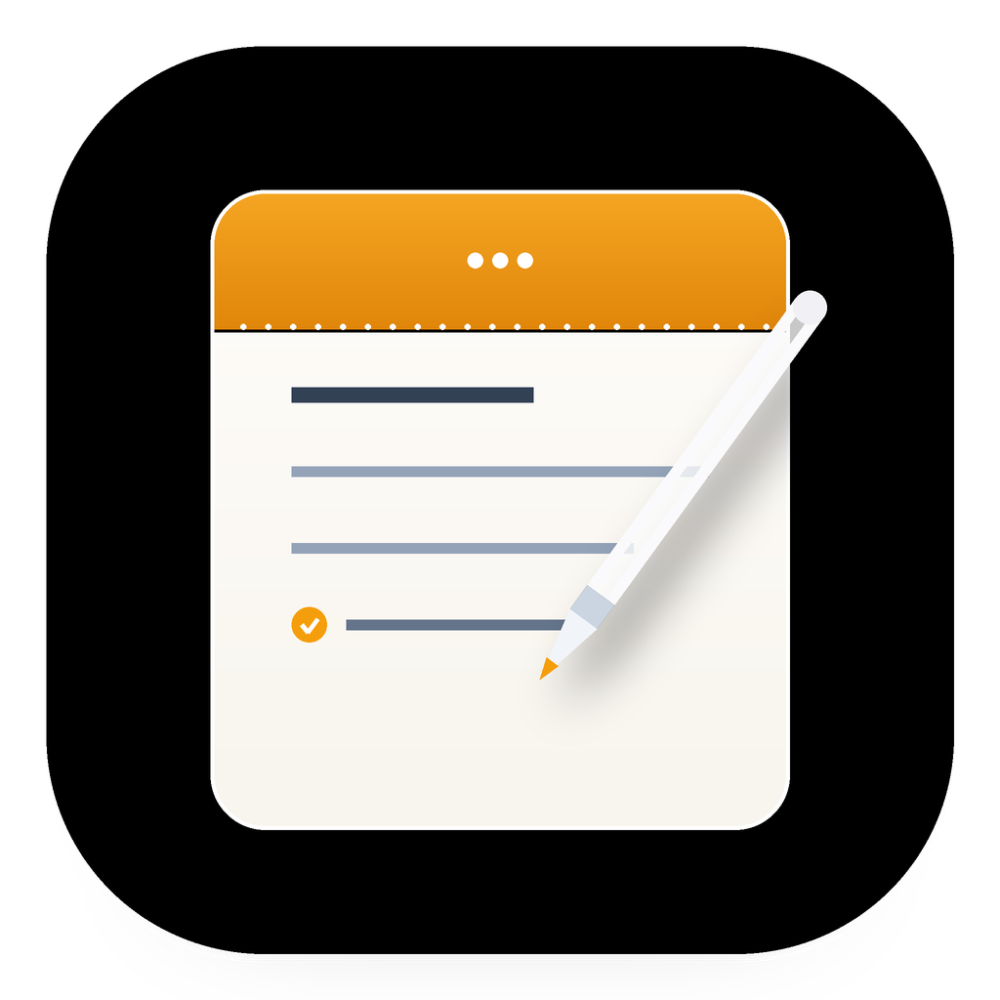
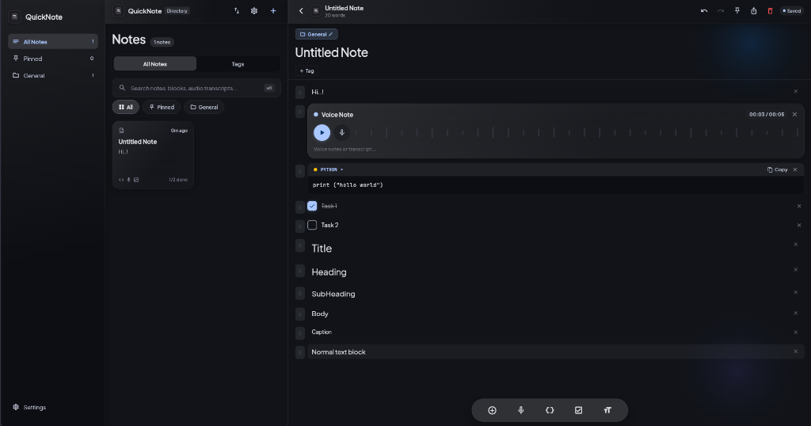
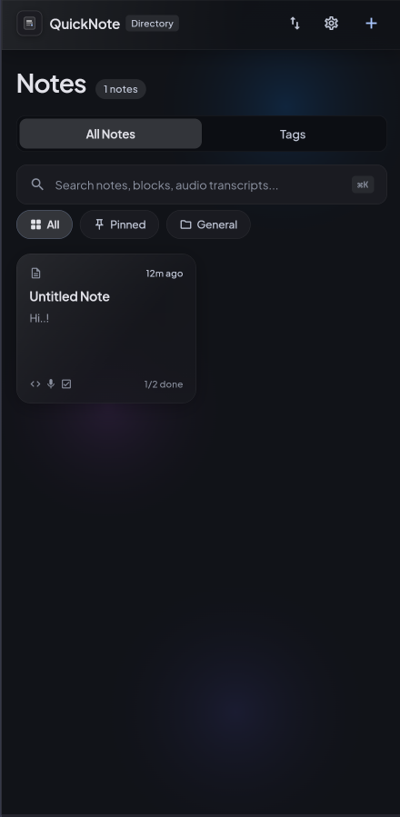
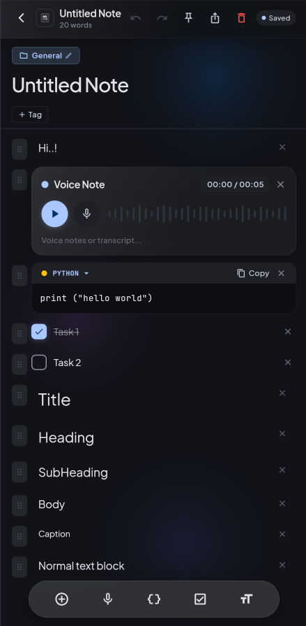
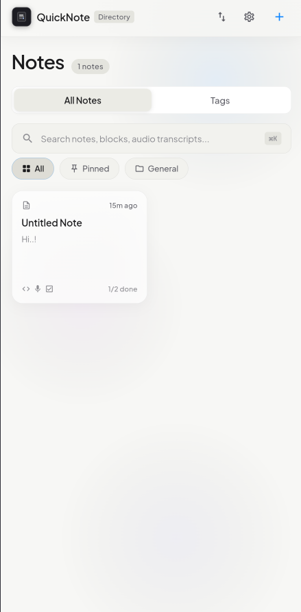
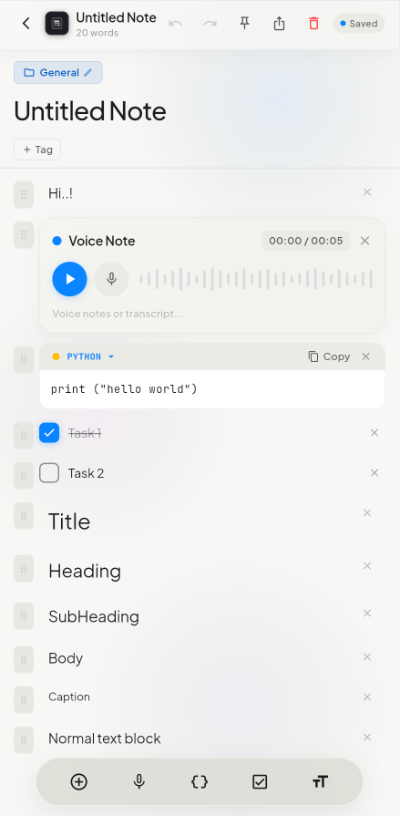

<p align="center">
  
</p>

# ⚡ QuickNote

<p align="center">
  <strong>Hyper-fast, VisionOS-grade digital note-taking experience for Android and Web.</strong><br>
  Built with Flutter, BLoC/Cubit, Pure Dart Core, and Clean Architecture in a Melos monorepo.
</p>

<p align="center">
  <a href="https://github.com/AdibSZ/QuickNote/releases/latest"></a>
  <a href="https://github.com/AdibSZ/QuickNote/actions"></a>
  <a href="LICENSE"></a>
  
</p>

<p align="center">
  <a href="#why-quicknote">Why QuickNote?</a> •
  <a href="#key-features">Key Features</a> •
  <a href="#download--installation">Download & Install</a> •
  <a href="#architecture">Architecture</a> •
  <a href="#راهنمای-فارسی">راهنمای فارسی و دانلود</a>
</p>

<p align="center">
  
</p>

---

## ✨ Why QuickNote?

Most note-taking apps are bloated, sluggish, or lock your thoughts behind mandatory cloud subscriptions. **QuickNote** was engineered from the ground up for instantaneous capture, sheer visual elegance, and uncompromising privacy:

- 🚀 **Zero-Lag Startup & Instant Capture:** Opens in milliseconds, zero loading spinners, immediate typing readiness.
- 💎 **Apple VisionOS & Sequoia Aesthetics:** Real-time deep frosted glass refraction (`BackdropFilter`), ambient dual-layer glows, and specular border sheens.
- 🇮🇷 **Native Bilingual Engine (Persian & English):** 1-tap complete RTL/LTR localization. Full Persian UI, typography, and automatic bidirectional paragraph alignment.
- 🛡️ **100% Offline & Private:** Your notes live locally on your device with high-integrity Write-Ahead Logging (WAL) and local passcode lock.

---

## 🚀 Key Features

### 📝 1. Rich Block-Based Note Architecture
- **Instant 1-Tap Block Insertion:** Directly add clean text paragraphs, headings, checklists, quotes, callouts, and code blocks from the docked bottom bar without intrusive menus.
- **Smart Markdown Auto-Transformation:** Type `# `, `## `, `- `, `[] `, `! `, `> `, or ` ``` ` on any line to instantly transform it into headings, tasks, callouts, quotes, or code blocks with tactile haptic feedback.
- **Fluid Drag & Reorder:** Reorganize your thoughts with butter-smooth spring reordering and 3D elevation shadows.

### 🎨 2. Creative Media & Interactive Tools
- 🎙️ **Apple Voice Memos Recording:** Direct microphone recording with live animated frequency waveforms, pause/stop/delete controls, and automatic time tracking.
- 🎨 **Doodle & Handwriting Canvas:** Built-in vector drawing canvas with customizable stroke widths, palettes, undo/clear actions, and inline card rendering.
- 🖼️ **Media Attachments:** Insert high-res photos seamlessly inside notes with custom captions and lightbox zoom.
- ⚡ **Docked Quick Actions:** 1-tap addition of headers, checklists, voice notes, doodles, and date stamps.

### 🔒 3. Security, Zen & Productivity
- 🔐 **Note Security Lock:** Lock sensitive or private notes with a secure PIN passcode and discreet privacy cards.
- 🧘 **Zen Focus Mode:** Distraction-free typewriter view for deep writing sessions.
- 🖼️ **Aesthetic Social Card Generator:** Turn any note into a gorgeous, shareable VisionOS-styled graphic card for social media or messaging.
- ⏰ **Smart Reminders:** Schedule alarms and deadline notifications for important notes.
- 🎨 **Color Hue Customization:** Tint note cards with subtle Apple pastel accents (Coral, Amber, Emerald, Azure, Indigo, Rose).

### 💾 4. Backup, Export & Portability
- 📦 **Local Zip Archive Backup & Restore:** Complete offline backup of your entire note vault into a portable `.zip` archive.
- 📋 **Universal Export:** Copy notes as formatted Markdown or structured JSON with a single tap.
- 🔍 **Spotlight Search (⌘K / Ctrl+K):** Lightning-fast fuzzy search across note titles, body blocks, tags, and transcripts.

---

## 📱 UI Showcase

<p align="center">
  
  &nbsp;
  
  &nbsp;
  
  &nbsp;
  
</p>

---

## 📲 Download & Installation

### Android (APK)
You can directly download and install the latest signed release APK:
1. Head over to the **[Latest Releases](https://github.com/AdibSZ/QuickNote/releases/latest)**.
2. Download **`app-release.apk`**.
3. Open the APK on your Android device and install (allow unknown sources if prompted).

### Web (Live / Local)
QuickNote is fully responsive and runs on any modern browser:
```bash
cd apps/quicknote
flutter run -d chrome
```

---

## 🏗️ Architecture & Engineering

QuickNote strictly enforces Clean Architecture and Melos package boundary isolation:

```
QuickNote/
├── apps/
│   └── quicknote/               # Flutter Presentation, Theme & VisionOS UI Kit
│       ├── lib/
│       │   ├── core/            # Theme, Localization, AppEmblem, GlassContainer
│       │   └── features/        # Editor, Directory, Settings, Security, Zen
│       └── test/                # Comprehensive Widget & Integration Tests
└── packages/
    ├── core/
    │   ├── quicknote_core/      # Pure Dart (TextRegistry, TextKey, Locale engine)
    │   └── quicknote_storage/   # Pure Dart storage abstractions & JSON WAL engine
    └── features/
        └── quicknote_notes/     # Pure Dart Domain, Note Models, BLoC/Cubit
```

> [!IMPORTANT]
> All core and feature packages (`packages/*`) are **100% Pure Dart** with zero dependency on `package:flutter`.

---

<div dir="rtl">

## 🇮🇷 راهنمای فارسی و ویژگی‌های منحصربه‌فرد

### کوییک‌نوت (QuickNote)؛ لذت یادداشت‌برداری با استانداردهای اپل و ویژن‌او‌اس
اگر به دنبال اپلیکیشنی هستید که نه کند شود، نه پر از تبلیغات آزاردهنده باشد و نه برای دسترسی به یادداشت‌هایتان نیاز به اینترنت یا اشتراک ماهانه داشته باشد، **QuickNote** دقیقاً برای شما ساخته شده است.

### 🌟 چرا باید QuickNote را روی گوشی خود نصب کنید؟
1. **سرعت مافوق صوت (Zero Lag):** اپلیکیشن در کسری از ثانیه باز می‌شود؛ فوراً دکمه `+` را بزنید و بلافاصله شروع به نوشتن کنید.
2. **رابط کاربری لوکس و چشم‌نواز (VisionOS Glass):** طراحی مدرن شیشه‌ای مات، انعکاس نوری ظریف در لبه‌ها و تایپوگرافی چشم‌نواز، حس کار با سیستم‌عامل آینده اپل را در دستان شما قرار می‌دهد.
3. **پشتیبانی کامل و اصیل از زبان فارسی:** بر خلاف اکثر برنامه‌های خارجی که با متن فارسی به هم می‌ریزند، QuickNote دارای موتور تغییر زبان کامل به فارسی با چیدمان راست‌به‌چپ (RTL)، پشتیبانی بی‌نقص از فونت زیبای وزیرمتن و هدرها و ابزارهای کاملاً فارسی است.
4. **نوار ابزار هوشمند در دسترس انگشت شست:** افزودن مستقیم متن، سرتیتر، چک‌لیست کارها، نقاشی دستی، ضبط صدا با نمایشگر امواج صوتی زنده، کادر ویژه، کد برنامه‌نویسی، خط جداکننده و نمودار.
5. **حفظ حریم خصوصی و امنیت بالا:** امکان قفل کردن یادداشت‌های شخصی و محرمانه با رمز عبور ۴ رقمی و پنهان‌سازی پیش‌نمایش در صفحه اصلی.
6. **کارت گرافیکی برای اشتراک‌گذاری (Aesthetic Card):** با یک لمس یادداشت یا دل‌نوشته خود را به یک کارت گرافیکی با استایل شیشه‌ای لوکس تبدیل کرده و در اینستاگرام، تلگرام یا واتساپ به اشتراک بگذارید.
7. **پشتیبان‌گیری آفلاین در قالب فایل فشرده (.zip):** تمام یادداشت‌های خود را در قالب یک فایل زیپ یا مارک‌داون استخراج کرده و هر زمان خواستید بازیابی کنید.

### 📥 نحوه نصب روی گوشی اندروید:
1. به بخش **[انتشارها (Releases)](https://github.com/AdibSZ/QuickNote/releases/latest)** در گیتهاب مراجعه کنید.
2. فایل **`app-release.apk`** را دانلود نمایید.
3. فایل را روی گوشی باز کرده و دکمه نصب (Install) را بزنید.

</div>

---

## 👨‍💻 Author

Developed with ❤️ by **[AdibSZ](https://github.com/AdibSZ)**  
📧 Email: [adibshamilzadeh@gmail.com](mailto:adibshamilzadeh@gmail.com)  
🐙 GitHub: [@AdibSZ](https://github.com/AdibSZ)

---

## 📜 License

This project is licensed under the MIT License - see the [LICENSE](LICENSE) file for details.
