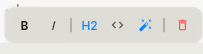
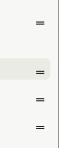

# ⚡ QuickNote

<p align="center">
  
</p>

<p align="center">
  <strong>Hyper-fast, offline-first note-taking app inspired by Apple VisionOS & macOS design language.</strong><br>
  Built with Flutter, BLoC/Cubit, Pure Dart Core, and Clean Architecture in a Melos monorepo.
</p>

<p align="center">
  <a href="#features">Features</a> •
  <a href="#architecture">Architecture</a> •
  <a href="#getting-started">Getting Started</a> •
  <a href="#راهنمای-فارسی">راهنمای فارسی</a>
</p>

---

## ✨ Features

- 🍏 **Apple VisionOS & Sequoia Aesthetic:** Pristine neutral canvas, frosted glass containers (`BackdropFilter`), specular hairline borders, and fluid 60fps micro-animations.
- 📝 **Block-Based Note Editor:** Reorderable blocks with smooth spring entry animations.
- ⚡ **Markdown Auto-Transformations:** Typing `# `, `## `, `- `, `[] `, or ` ``` ` automatically transforms paragraph blocks into Headings, Checklists, or Code Blocks with haptic feedback.
- 🎙️ **Apple Voice Memos Visualizer:** Live mic recording with Opus/WebM audio encoding and a 60fps harmonic waveform visualizer featuring a parabolic envelope.
- 📌 **Smart Note Organization:** Automatic partitioning between **PINNED** and **NOTES**, tag filtering chips, and dynamic pastel category accents.
- 🔄 **Real-Time Dynamic Stats:** Note cards show live checklist progress (`2/5 done` with green badge on completion) and word counts.
- 🔍 **⌘K Spotlight Search & Multi-Sort:** Lightning-fast full-text search with instant sorting by Date Modified, Date Created, or Alphabetical (A-Z).
- 📤 **Rich Export & Sharing:** Export modal with reading stats (word count, char count, estimated read time) and 1-tap copy as Markdown or Plain Text.
- 🌐 **Dynamic RTL & Luxury Typography:** Features **Plus Jakarta Sans** for English chrome, **JetBrains Mono** for code blocks, and automatic **Vazirmatn** fallback with per-block RTL detection for Persian/Arabic text.
- 🔒 **100% Offline-First:** Ultra-fast in-memory persistence with zero latency disk synchronization.

<p align="center">
  
</p>

---

## 🏛️ Architecture & Monorepo Structure

QuickNote strictly follows Clean Architecture and package boundary isolation:

```
QuickNote/
├── apps/
│   └── quicknote/               # Flutter Presentation & UI Kit Layer
│       ├── lib/
│       │   ├── core/            # Theme, Apple Glass UI Kit, Typography
│       │   └── features/        # Editor, Directory, Settings, Responsive
│       └── test/                # Comprehensive Widget & Integration Tests
└── packages/
    ├── core/
    │   ├── quicknote_core/      # Pure Dart localization (TextRegistry, TextKey)
    │   └── quicknote_storage/   # Pure Dart storage abstractions & JSON WAL engine
    └── features/
        └── quicknote_notes/     # Pure Dart Domain, Note Models, BLoC/Cubit
```

> [!NOTE]
> All core and feature packages (`packages/*`) are **100% Pure Dart** with zero dependency on `package:flutter`.

---

## 🚀 Getting Started

### Prerequisites
- [Flutter SDK](https://docs.flutter.dev/get-started/install) (>= 3.13.2)
- [Melos](https://melos.invertase.dev/) (Optional, for multi-package management)

### Installation & Run

1. **Clone the repository:**
   ```bash
   git clone https://github.com/AdibSZ/QuickNote.git
   cd QuickNote
   ```

2. **Bootstrap packages:**
   ```bash
   cd apps/quicknote
   flutter pub get
   ```

3. **Run on Web, Desktop, or Mobile:**
   ```bash
   # Run in Chrome (Web)
   flutter run -d chrome

   # Run on Windows Desktop
   flutter run -d windows
   ```

4. **Run Analysis & Tests:**
   ```bash
   flutter analyze
   flutter test
   ```

---

<div dir="rtl">

## 🇮🇷 راهنمای فارسی (Persian Documentation)

### معرفی پروژه
**QuickNote** یک اپلیکیشن یادداشت‌برداری مدرن، فوق‌سریع و کاملاً آفلاین است که با الهام از زبان طراحی **Apple VisionOS** و **macOS Sequoia** پیاده‌سازی شده است. این پروژه با بهره‌گیری از **Flutter**، معماری چندپکیجی **Melos Monorepo** و کیوبیت‌های کاملاً مستقل (Pure Dart BLoC) توسعه یافته است.

### 🌟 قابلیت‌های برجسته
- **طراحی شیشه‌ای لوکس (Glassmorphism):** بوم خنثی و تمیز با کارت‌های شیشه‌ای مات، افکت بازتاب نور در حاشیه‌ها، و انیمیشن‌های نرم ۶۰ فریم بر ثانیه.
- **ویرایشگر بلاک‌محور با تبدیل خودکار مارک‌داون:** تبدیل بلادرنگ `# ` به عنوان، `- ` به چک‌لیست و ` ``` ` به بلاک کد به همراه بازخورد لمسی (Haptic).
- **ضبط و پخش صدا شبیه Apple Voice Memos:** ضبط مستقیم با فرمت وب Opus/WebM و ویژوالایزر امواج صوتی هارمونیک و پیوسته.
- **تفکیک خودکار یادداشت‌های پین‌شده:** جداسازی هوشمندانه بخش `PINNED` و `NOTES` درست شبیه اپلیکیشن رسمی Apple Notes.
- **سیستم مرتب‌سازی چندگانه:** مرتب‌سازی بلادرنگ بر اساس تاریخ ویرایش، تاریخ ایجاد و عنوان الفبایی (A-Z).
- **شمارش پیشرفت و آمار زنده:** محاسبه خودکار درصد انجام وظایف چک‌لیست (`done X/Y`)، تعداد کلمات و زمان مطالعه.
- **تایپوگرافی هوشمند دوجهته:** فونت لوکس **Plus Jakarta Sans** برای پوسته انگلیسی، **JetBrains Mono** برای کدها، و فونت زیبای **وزیرمتن (Vazirmatn)** با تشخیص خودکار جهت متن راست‌به‌چپ (RTL) برای یادداشت‌های فارسی.
- **اشتراک‌گذاری پیشرفته:** کپی سریع با فرمت استاندارد مارک‌داون یا متن ساده (Plain Text).

### 🛠️ ساختار مهندسی و معماری
پروژه بر اساس تفکیک کامل لایه‌ها طراحی شده است:
1. **`packages/core/*` و `packages/features/*`:** پکیج‌های دامنه، مدل‌ها و کیوبیت‌ها که **۱۰۰٪ Pure Dart** هستند و هیچ‌گونه وابستگی به فلاتر ندارند.
2. **`apps/quicknote`:** لایه نمایش، ویجت‌های Passive BLoC، و کیت بصری شیشه‌ای.
3. **قانون ۳۰۰ سطر:** تمامی فایل‌های کد منبع برای خوانایی بالا و رعایت اصل Single Responsibility کمتر از ۳۰۰ سطر نگهداری شده‌اند.

---

### 👨‍💻 توسعه‌دهنده (Author)
توسعه‌یافته توسط **[ادیب شامل‌زاده (AdibSZ)](https://github.com/AdibSZ)**  
ایمیل: adibshamilzadeh@gmail.com

---

### 📄 مجوز (License)
این پروژه تحت مجوز MIT منتشر شده است.
</div>
